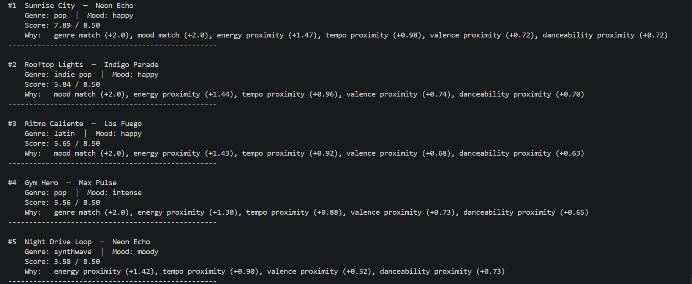

# 🎵 Music Recommender Simulation

## Project Summary

In this project you will build and explain a small music recommender system.

Your goal is to:

- Represent songs and a user "taste profile" as data
- Design a scoring rule that turns that data into recommendations
- Evaluate what your system gets right and wrong
- Reflect on how this mirrors real world AI recommenders

Replace this paragraph with your own summary of what your version does.

---

## How The System Works

Explain your design in plain language.

Some prompts to answer:

- What features does each `Song` use in your system
  - For example: genre, mood, energy, tempo
- What information does your `UserProfile` store
- How does your `Recommender` compute a score for each song
- How do you choose which songs to recommend

You can include a simple diagram or bullet list if helpful.

Each Song uses six features: genre, mood, energy, tempo_bpm, valence, and acousticness.

The UserProfile stores a favorite_genre, favorite_mood, target_energy, and a boolean likes_acoustic.

The Recommender scores each song by comparing its features to the user profile. Categorical features like genre and mood receive full points on an exact match. Numerical features like energy, valence, and acousticness are scored by proximity, meaning the closer a song's value is to the user's target, the higher the score. Each feature score is multiplied by a weight and all weighted scores are added together into one final number. The songs with the highest final scores are selected and the top k results are returned as recommendations.

### Data Flow Diagram

See [data_flow.md](data_flow.md) for the full Mermaid.js flowchart.

### Algorithm Recipe

The scoring function evaluates each song against the user profile using this point system:

| Feature | Rule | Points |
|---|---|---|
| Genre | Exact match | +2.0 |
| Mood | Exact match | +1.0 |
| Energy | `(1 − \|song.energy − user.energy\|) × 1.5` | up to +1.5 |
| Valence | `(1 − \|song.valence − user.valence\|) × 0.5` | up to +0.5 |
| Danceability | `(1 − \|song.danceability − user.danceability\|) × 0.5` | up to +0.5 |
| Acousticness | `(1 − \|song.acousticness − user.acousticness\|) × 0.5` | up to +0.5 |
| Acoustic bonus | `likes_acoustic` is True AND `song.acousticness > 0.7` | +0.5 |

**Maximum possible score: ~6.5 points**

Genre is weighted highest because it is the broadest structural filter. Energy carries the most weight among continuous features because it best captures how a song "feels" in the moment. Valence, danceability, and acousticness act as tiebreakers that fine-tune the ranking.

### Potential Biases

- **Genre dominance.** A song in the wrong genre can never outscore a genre match even if every other feature is a perfect fit. A great mood/energy match in a neighboring genre (e.g., indie pop vs. pop) will always rank below a weak genre match.
- **Mood rigidity.** Mood is an exact string match. Adjacent moods like "relaxed" and "chill" are treated as completely unrelated, so a close vibe match can be penalized simply because of label wording.
- **Small catalog amplification.** With only 20 songs, a single genre match can dominate the entire top-K list. In a larger catalog this effect would be diluted.
- **Acoustic bonus only goes one way.** Users who prefer non-acoustic songs receive no equivalent bonus, giving acoustic listeners a built-in scoring advantage.

---

## Getting Started

### Setup

1. Create a virtual environment (optional but recommended):

   ```bash
   python -m venv .venv
   source .venv/bin/activate      # Mac or Linux
   .venv\Scripts\activate         # Windows

2. Install dependencies

```bash
pip install -r requirements.txt
```

3. Run the app:

```bash
python -m src.main
```

### Sample Output



### Running Tests

Run the starter tests with:

```bash
pytest
```

You can add more tests in `tests/test_recommender.py`.

---

## Experiments You Tried

Use this section to document the experiments you ran. For example:

- What happened when you changed the weight on genre from 2.0 to 0.5
- What happened when you added tempo or valence to the score
- How did your system behave for different types of users

---

## Limitations and Risks

Summarize some limitations of your recommender.

Examples:

- It only works on a tiny catalog
- It does not understand lyrics or language
- It might over favor one genre or mood

You will go deeper on this in your model card.

---

## Reflection

Read and complete `model_card.md`:

[**Model Card**](model_card.md)

Write 1 to 2 paragraphs here about what you learned:

- about how recommenders turn data into predictions
- about where bias or unfairness could show up in systems like this


---

## 7. `model_card_template.md`

Combines reflection and model card framing from the Module 3 guidance. :contentReference[oaicite:2]{index=2}  

```markdown
# 🎧 Model Card - Music Recommender Simulation

## 1. Model Name

Give your recommender a name, for example:

> VibeFinder 1.0

---

## 2. Intended Use

- What is this system trying to do
- Who is it for

Example:

> This model suggests 3 to 5 songs from a small catalog based on a user's preferred genre, mood, and energy level. It is for classroom exploration only, not for real users.

---

## 3. How It Works (Short Explanation)

Describe your scoring logic in plain language.

- What features of each song does it consider
- What information about the user does it use
- How does it turn those into a number

Try to avoid code in this section, treat it like an explanation to a non programmer.

---

## 4. Data

Describe your dataset.

- How many songs are in `data/songs.csv`
- Did you add or remove any songs
- What kinds of genres or moods are represented
- Whose taste does this data mostly reflect

---

## 5. Strengths

Where does your recommender work well

You can think about:
- Situations where the top results "felt right"
- Particular user profiles it served well
- Simplicity or transparency benefits

---

## 6. Limitations and Bias

Where does your recommender struggle

Some prompts:
- Does it ignore some genres or moods
- Does it treat all users as if they have the same taste shape
- Is it biased toward high energy or one genre by default
- How could this be unfair if used in a real product

---

## 7. Evaluation

How did you check your system

Examples:
- You tried multiple user profiles and wrote down whether the results matched your expectations
- You compared your simulation to what a real app like Spotify or YouTube tends to recommend
- You wrote tests for your scoring logic

You do not need a numeric metric, but if you used one, explain what it measures.

---

## 8. Future Work

If you had more time, how would you improve this recommender

Examples:

- Add support for multiple users and "group vibe" recommendations
- Balance diversity of songs instead of always picking the closest match
- Use more features, like tempo ranges or lyric themes

---

## 9. Personal Reflection

A few sentences about what you learned:

- What surprised you about how your system behaved
- How did building this change how you think about real music recommenders
- Where do you think human judgment still matters, even if the model seems "smart"

