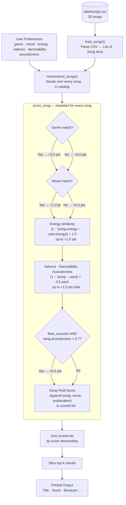

# Data Flow Diagram — Music Recommender Simulation

```mermaid
flowchart TD
    A["User Preferences
    genre · mood · energy
    valence · danceability · acousticness"]
    B[("data/songs.csv
    20 songs")]

    A --> R
    B --> L

    L["load_songs()
    Parse CSV → List of Song dicts"]
    L --> R

    R["recommend_songs()
    Iterate over every song in catalog"]
    R --> LOOP

    subgraph LOOP ["score_song — repeated for every song"]
        direction TB
        S1{"Genre match?"}
        S1 -->|"Yes → +2.0 pts"| S2
        S1 -->|"No →  +0.0 pts"| S2
        S2{"Mood match?"}
        S2 -->|"Yes → +1.0 pt"| S3
        S2 -->|"No →  +0.0 pts"| S3
        S3["Energy similarity
        (1 − |song.energy − user.energy|) × 1.5
        up to +1.5 pts"]
        S3 --> S4["Valence · Danceability · Acousticness
        (1 − |song − user|) × 0.5 each
        up to +1.5 pts total"]
        S4 --> S5{"likes_acoustic AND
        song.acousticness > 0.7?"}
        S5 -->|"Yes → +0.5 pts"| S6
        S5 -->|"No"| S6
        S6["Song Final Score
        Append (song, score, explanation)
        to scored list"]
    end

    LOOP --> SORT["Sort scored list
    by score descending"]
    SORT --> TOP["Slice top K results"]
    TOP --> OUT["Printed Output
    Title · Score · Because: ..."]
```

**Maximum possible score: ~6.5 pts** (2.0 genre + 1.0 mood + 1.5 energy + 1.5 proximity + 0.5 acoustic bonus)
